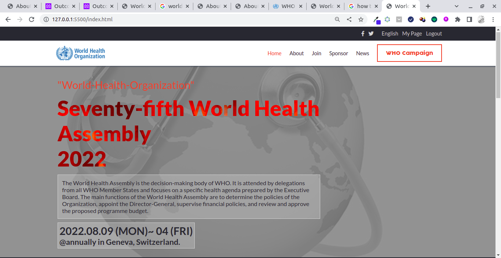

<a name="readme-top"></a>

<!--
HOW TO USE:
This is an example of how you may give instructions on setting up your project locally.

Modify this file to match your project and remove sections that don't apply.

REQUIRED SECTIONS:
- Table of Contents
- About the Project
  - Built With
  - Live Demo
- Getting Started
- Authors
- Future Features
- Contributing
- Show your support
- Acknowledgements
- License

OPTIONAL SECTIONS:
- FAQ

After you're finished please remove all the comments and instructions!
-->

<div align="center">

  <h3><b>World-Health-Assembly</b></h3>

</div>

<!-- TABLE OF CONTENTS -->

# 📗 Table of Contents

- [📖 About the Project](#about-project)
  - [🛠 Built With](#built-with)
    - [Tech Stack](#tech-stack)
    - [Key Features](#key-features)
  - [🚀 Live Demo](#live-demo)
- [💻 Getting Started](#getting-started)
  - [Setup](#setup)
  - [Prerequisites](#prerequisites)
  - [Install](#install)
  - [Usage](#usage)
  - [Run tests](#run-tests)
  - [Deployment](#triangular_flag_on_post-deployment)
- [👥 Authors](#authors)
- [🔭 Future Features](#future-features)
- [🤝 Contributing](#contributing)
- [⭐️ Show your support](#support)
- [🙏 Acknowledgements](#acknowledgements)
- [❓ FAQ (OPTIONAL)](#faq)
- [📝 License](#license)

<!-- PROJECT DESCRIPTION -->

# 📖 World-Health-Assembly <a name="about-project"></a>


The World Health Assembly is the decision-making body of WHO. It is attended by delegations from all WHO Member States and focuses on a specific health agenda prepared by the Executive Board. The main functions of the World Health Assembly are to determine the policies of the Organization, appoint the Director-General, supervise financial policies, and review and approve the proposed programme budget. The Health Assembly is held annually in Geneva, Switzerland.

## 🛠 Built With <a name="built-with"></a>

### Tech Stack <a name="tech-stack"></a>

<details>
  <summary>Client</summary>
  <ul>
    <li>HTML</li>
    <li>CSS</li>
    <li>JavaScript</li>
  </ul>
</details>

<!-- Features -->

### Key Features <a name="key-features"></a>


- Display Featured speakers
- Tell about the Company
- Fully Responsive

<p align="right">(<a href="#readme-top">back to top</a>)</p>

<!-- LIVE DEMO -->

## 🚀 Live Demo <a name="live-demo"></a>


- [Conference Live Demo](https://world-health-organization.netlify.app/)



<p align="right">(<a href="#readme-top">back to top</a>)</p>

<!-- GETTING STARTED -->

## 💻 Getting Started <a name="getting-started"></a>


To get a local copy up and running, follow these steps.

### Prerequisites

In order to run this project you need:


```sh
 Node.js
```

### Setup

Clone this repository to your desired folder:


```sh
  cd my-folder
  git clone https://github.com/Alusp/World-Health-Assembly.git
```


### Install

Install this project with:


```sh
  cd World-Health-Assembly
  npm install
```

### Usage

To run the project, open index.html file in the browser


### Deployment

You can deploy this project using github pages


<p align="right">(<a href="#readme-top">back to top</a>)</p>

<!-- AUTHORS -->

## 👥 Authors <a name="authors"></a>


👤 **Alusine JAlloh**

- GitHub: [@Alusp](https://github.com/Alusp/World-Health-Assembly)
- LinkedIn: [@alusine-jalloh](https://www.linkedin.com/in/alusine-jalloh)


<p align="right">(<a href="#readme-top">back to top</a>)</p>

<!-- FUTURE FEATURES -->

## 🔭 Future Features <a name="future-features"></a>

- [ ] Add Sponsors pages
- [ ] Book Ticket
- [ ] Live Streaming

<p align="right">(<a href="#readme-top">back to top</a>)</p>

<!-- CONTRIBUTING -->

## 🤝 Contributing <a name="contributing"></a>

Contributions, issues, and feature requests are welcome!

Feel free to check the [issues page](https://github.com/Alusp/World-Health-Assembly/issues).

<p align="right">(<a href="#readme-top">back to top</a>)</p>

<!-- SUPPORT -->

## ⭐️ Show your support <a name="support"></a>


If you like this project please leave a star

<p align="right">(<a href="#readme-top">back to top</a>)</p>

<!-- ACKNOWLEDGEMENTS -->

## 🙏 Acknowledgments <a name="acknowledgements"></a>

- Original design idea by [Cindy Shin in Behance](https://www.behance.net/adagio07)

- Original logo [who.int](https://logos-download.com/wp-content/uploads/2016/12/World_Health_Organization_logo_logotype.png)

- Headline section background photo by [world-health-day](https://nationaltoday.com/world-health-day/)

<p align="right">(<a href="#readme-top">back to top</a>)</p>


<!-- LICENSE -->

## 📝 License <a name="license"></a>

This project is [MIT](./MIT.md) licensed.

<p align="right">(<a href="#readme-top">back to top</a>)</p>
