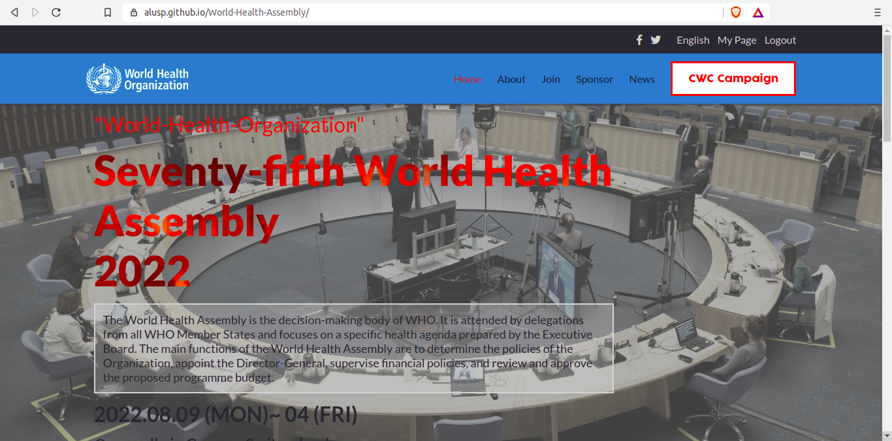

# Project Name

The World Health Assembly is the decision-making body of WHO. It is attended by delegations from all WHO Member States and focuses on a specific health agenda prepared by the Executive Board. The main functions of the World Health Assembly are to determine the policies of the Organization, appoint the Director-General, supervise financial policies, and review and approve the proposed programme budget. The Health Assembly is held annually in Geneva, Switzerland.

## Built With

- HTML,CSS and JavaScript
- VSCODE
- GIT

## Getting Started

To get a local copy up and running follow these simple example steps.
Locate the project folder in the Repository.
Click on the code button and dowload a zip file for the project locally.
Locate the index.html file and double click it to view webpage.

### Prerequisites
Node.js, stylelint, eslint browser for displaying it's content.
install node package manager(npm): npm helps to install stylelint.

### Setup
Download and install browser.

### Usage
Navigate through the web page to find the information you need. Use the links in the pages to move to different sections.

### Deployment
  Project reside in this Repo and is hosted on Github pages. You can clone the repo or download the files manually to your local machine.
  below is the online link for this website:

- GITHUB PAGES: [@WHO-Conference](https://alusp.github.io/World-Health-Assembly/)

## Authors

👤 **Alusine Jalloh**

- GitHub: [@Alusp](https://github.com/Alusp/World-Health-Assembly)
- LinkedIn: [@alusine-jalloh-873951209](https://www.linkedin.com/in/alusine-jalloh-873951209
)
 
## 🤝 Contributing

Contributions, issues, and feature requests are welcome!

Feel free to check the [issues page](../../issues/).

## Show your support

Give a ⭐️ if you like this project!

## Acknowledgments

- Hat tip to anyone whose code was used
- Inspiration
- etc

## 📝 License

This project is [MIT](./MIT.md) licensed.
